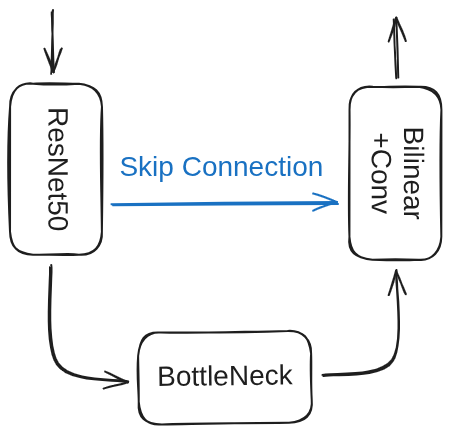

# ResNet50-UNet

A highly adaptable semantic segmentation framework combining the feature extraction power of **ResNet50** with the precise localization of **U-Net**.

Designed to be **task-agnostic**, this framework supports both **Binary Classification** (e.g., medical imaging, defect detection) and **Multi-Class Segmentation** (e.g., face parsing, scene understanding) by simply adjusting the configuration.

> **Current Demonstration**: This repository showcases the model's performance using the **LaPa Dataset** (Face Parsing, 11 classes) as a benchmark example.


---
### 🧠 Model Architecture

This project modifies the standard U-Net by replacing its encoder with a pre-trained **ResNet50**. This allows the model to leverage transfer learning from ImageNet, resulting in faster convergence and better feature representation.



---
### 📂 Project Structure
```text
ResUNet-Seg
├── checkpoints/     # Saved models & training logs (Not included in repo)
├── models/          # Model architecture definitions
│   └── resunet.py   # ResNet50-UNet implementation
├── config.py        # Configuration files
├── utils/           # Helper functions (Dataset, Loss, Metrics)
├── test_data/       # Put your test images here
├── test_results/    # Prediction outputs (Masks)
├── train.py         # Main training script
├── predict.py       # Inference script
└── requirements.txt # Python dependencies
```

---
### 🚀 Quick Start

### 1. Installation

Clone the repo and install dependencies:

```bash
git clone https://github.com/Jacky-0202/ResUNet-Seg.git
cd ResUNet-Seg
pip install -r requirements.txt
```

### 2. Configure Paths

Open `config.py` and set your dataset path:

```python
# src/config.py
DATASET_ROOT = "/path/to/your/LaPa_dataset"
```

### 3. Training

Start training the model (default: 100 epochs, Batch=16):

```python
python train.py
```

- Checkpoints are saved in `checkpoints/EXPERIMENT_NAME/`.
- Training logs are saved as CSV.

### 4. Inference (Testing)

Put your own images in the `test_data/` folder, then run:

```bash
python predict.py
```

The results (colored masks) will be saved in `test_results/`.
